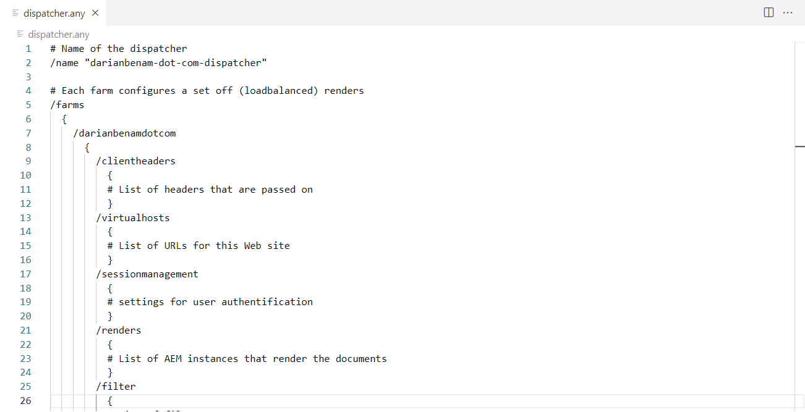
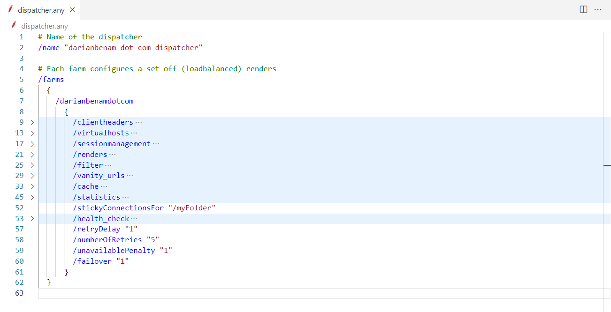

# Apache Dispatcher Config Language Support for Visual Studio Code

An extension for [Visual Studio Code](https://code.visualstudio.com) that enables language support for [Apache Dispatcher Config](https://experienceleague.adobe.com/docs/experience-manager-dispatcher/using/configuring/dispatcher-configuration.html?lang=en) files which is commonly used with Adobe Experience Manager. ⚙️

## Features

- Syntax Highlighting
- Property Folding
- Property and Value Documentation Hints
- Property and Value Autocompletion Hints
- Documentation Hints on Hover
- Document Outline Support
- Jump Link Support for the `$include` Function

## Supported File Formats

- `.any` (e.g., `dispatcher.any`)
- `.farm` (e.g., `default.farm`)

## Preview

### Config File Without Extension

### Config File With Extension

## Disclaimer

The `Apache Dispatcher Config Language Support for Visual Studio Code` extension is not affiliated or endorsed by [Adobe](https://www.adobe.com) or the [Apache Software Foundation](https://www.apache.org).

This extension integrates documentation snippets from [Adobe's Experience League Documentation website](https://experienceleague.adobe.com/docs/experience-manager-dispatcher/using/configuring/dispatcher-configuration.html?lang=en). All documentation featured in this extension is property of [Adobe](https://www.adobe.com).
